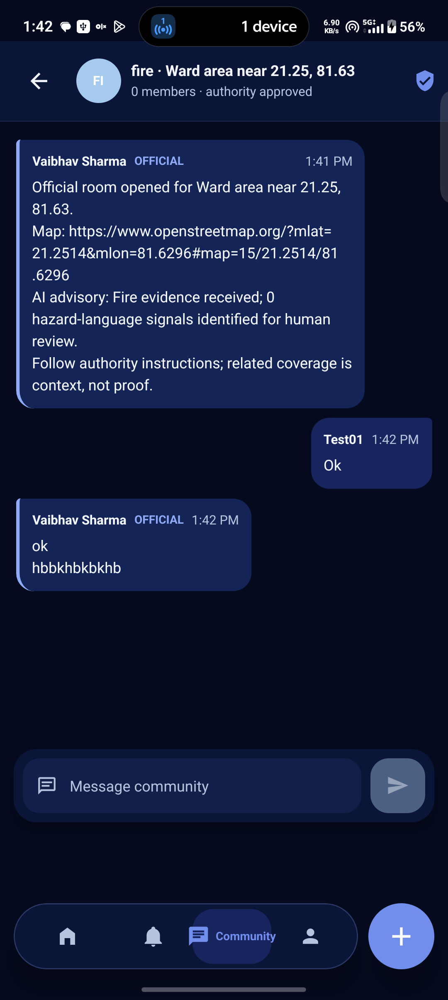
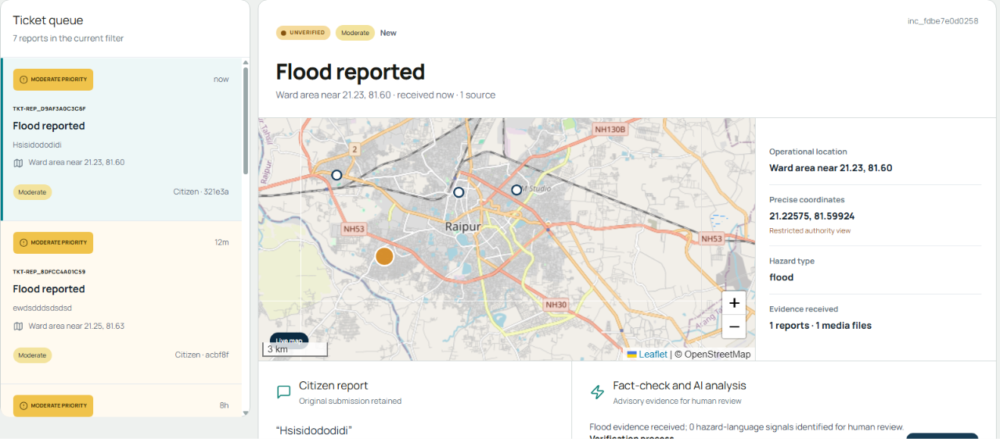
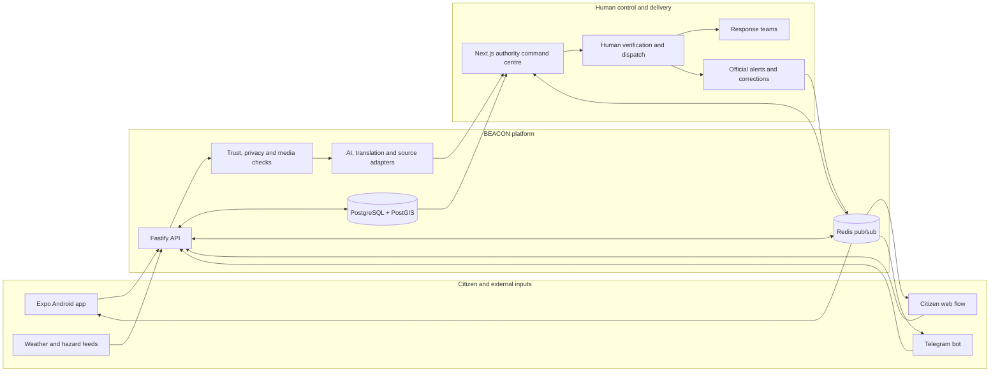
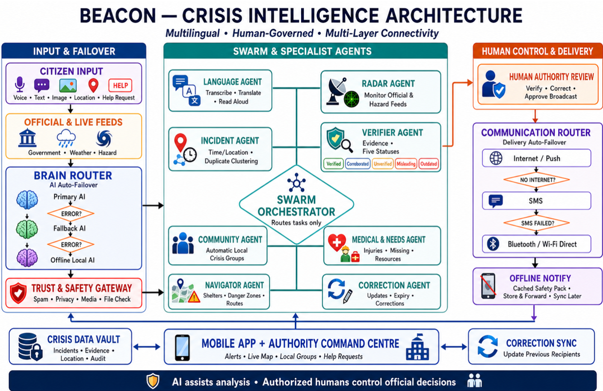

# BEACON

### Human-governed, multilingual crisis intelligence for connected and low-connectivity communities

BEACON turns citizen reports from the mobile app, web, and Telegram into a shared operational picture for emergency authorities. It combines location-aware intake, evidence handling, AI-assisted triage, human verification, responder dispatch, official alerts, corrections, and real-time citizen updates in one locally deployable platform.

> AI assists analysis. Authorized people make and publish official decisions.

## Product tour

### Citizen app

Citizens can report incidents, request emergency help, receive verified alerts, find nearby facilities, and join authority-approved community rooms. The mobile experience retains a cached safety context and queues work when connectivity is unreliable.

<p align="center">
  
</p>

### Authority command centre

The command centre gives officials a live incident queue, map context, original citizen evidence, AI and fact-check advisory signals, precise operational locations, audit history, response assignment, and controlled alert publishing.

<p align="center">
  
</p>

## Architecture



<details>
<summary>Detailed crisis-intelligence architecture</summary>

<p align="center">
  
</p>

</details>

## What BEACON does

- Accepts text, voice, photo, video, location, and SOS reports.
- Preserves original-language submissions and supports 12 Indian languages across citizen channels.
- Clusters incidents by time and location, while keeping AI output advisory.
- Adds optional BHASHINI translation, Google Fact Check ClaimReview results, and GDELT related-news context.
- Requires an authorized official to verify, correct, dispatch, or publish.
- Streams incident, alert, correction, dispatch, and SOS changes over Redis-backed WebSockets.
- Supports an Expo Android app, judge-friendly citizen web flow, and Telegram bot from one operational backend.
- Retains audit history and visibly supersedes outdated alerts with corrections.

## Tech stack

| Layer | Technology |
| --- | --- |
| Citizen mobile app | Expo, React Native, TypeScript |
| Authority dashboard and citizen web | Next.js 16, React 19, Leaflet |
| API | Fastify, TypeScript, Drizzle ORM |
| Data | PostgreSQL, PostGIS |
| Realtime coordination | Redis pub/sub, WebSockets |
| Messaging | Telegram Bot API |
| Optional intelligence adapters | BHASHINI, Google Fact Check API, GDELT |
| Local deployment | Docker Compose |

The original FastAPI implementation under `backend/` is retained as a fallback and reference service.

## Quick start

### Prerequisites

- Node.js 20 or newer
- Docker Desktop with Docker Compose
- Expo Go or an Android device/emulator for the native app

### Start the complete local stack

```powershell
npm install
docker compose up --build -d
```

Open:

- Authority command centre: <http://localhost:3000>
- Citizen web app: <http://localhost:3000/citizen>
- API health check: <http://localhost:8000/api/v1/health>

Demo authority accounts:

| Role | Email | Password |
| --- | --- | --- |
| Administrator | `admin@beacon.local` | `BeaconDemo!26` |
| Responder | `responder@beacon.local` | `ResponderDemo!26` |

These credentials are only for the local prototype.

### Run the native citizen app

```powershell
npm run dev:mobile -- --lan
```

For a phone on the same Wi-Fi network, add the following to `apps/mobile/.env.local`:

```dotenv
EXPO_PUBLIC_API_URL=http://<computer-lan-ip>:8000/api/v1
```

When this value is absent, Expo attempts to derive the LAN host from Metro.

## Configuration

Copy the required values from `.env.example` into an ignored root `.env` file. External adapters are optional: the core reporting, review, and alert workflow remains usable when credentials are missing or a provider is unavailable.

For Telegram, create a bot with the official `@BotFather` and set:

```dotenv
TELEGRAM_BOT_TOKEN=<token>
```

Never place bot tokens or provider credentials in Expo configuration, client code, commits, logs, or screenshots. Without a token, the Telegram service remains healthy in `waiting_for_token` state.

## Demo journey

1. Open `/citizen`, register, and submit a report or hold the SOS control.
2. Open `/`, select the incoming incident, and review its evidence and advisory analysis.
3. Verify the report (or use the audited demo bypass), assign a responder, and publish an official alert.
4. Watch the citizen view receive the update in real time.
5. Publish a correction to demonstrate how BEACON supersedes the earlier alert for previous recipients.

No disaster is pre-seeded. `POST /api/v1/demo/reset` clears judge-created operational data while retaining local demo users and facilities.

## Verification

With the Compose stack running, verify the report-to-command-centre real-time path:

```powershell
npm run smoke:realtime
```

This creates a temporary citizen report, confirms the Redis-backed WebSocket event, and checks that the incident appears in the authenticated authority queue. Reset demo data before a presentation if the smoke test has been run.

Other useful commands:

```powershell
npm run build:web
npm run build:api
npm run test:api
npm run test:telegram
npm run smoke:telegram
```

## Services

Docker Compose starts five health-checked services:

| Service | Purpose |
| --- | --- |
| `dashboard` | Authority command centre and citizen web experience |
| `api` | Ingestion, analysis, verification, dispatch, and alert APIs |
| `postgis` | Persistent relational and geospatial data |
| `redis` | Real-time events and pub/sub coordination |
| `telegram-bot` | Telegram citizen access and update delivery |

Database, Redis, and evidence-upload volumes survive normal restarts. Stop the stack without deleting data using:

```powershell
docker compose down
```

## Repository layout

```text
apps/
  api/           Fastify API, Drizzle schema, tests, and integrations
  dashboard/     Next.js authority dashboard and citizen web flow
  mobile/        Expo React Native citizen app
  telegram-bot/  Telegram citizen interface
backend/         Original FastAPI fallback/reference implementation
Extension/       BEACON Lens browser extension
scripts/         Local smoke tests and development utilities
```

## Safety model

BEACON deliberately separates machine assistance from public authority. Related coverage is context rather than proof, model confidence is not a truth score, and only an authenticated official can publish a verified alert or correction.
